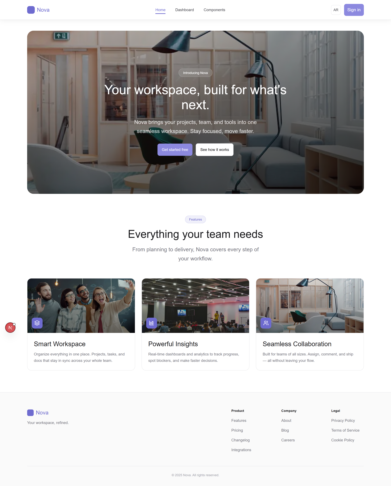
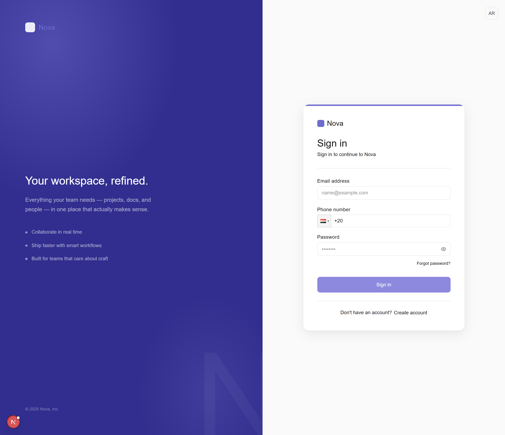
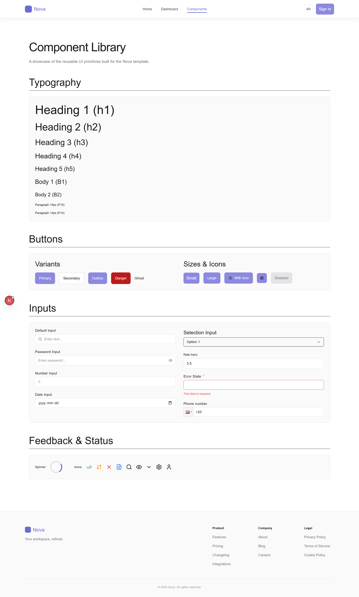

# 🚀 **Nova Next.js Template**

A production-ready Next.js template that provides a modern, scalable foundation for building web applications. It includes:

- Routing with layouts (Auth/Main groups)
- Theming and SCSS styling system
- API integration with RTK Query
- State management with Redux Toolkit
- Internationalization (i18n) with dynamic language routing
- Reusable UI component library
- Utility functions and custom hooks
- AI-ready architecture with built-in AI utilities
- An overall ready-for-integration template with a structured design system.

## 📋 Table of Contents

- [✨ Features](#-features)
- [🛠️ Installation](#️-installation)
- [⚙️ Prerequisites](#️-prerequisites)
- [📚 Usage](#-usage)
- [📸 Screenshots](#-screenshots)
- [🏗️ Project Structure](#️-project-structure)
- [📋 Changelog](#-changelog)
- [🤝 Contributing](#-contributing)
- [📄 License](#-license)

## ✨ Features

- **[Next.js 16](https://nextjs.org/)**: The React framework for production — server-side rendering, static generation, and more.
- **[React 19](https://react.dev/)**: The latest version of React with concurrent features.
- **[TypeScript](https://www.typescriptlang.org/)**: A strongly typed programming language that builds on JavaScript.
- **[SCSS/Sass](https://sass-lang.com/)**: Professional-grade CSS preprocessor with variables, mixins, and functions.
- **[Redux Toolkit](https://redux-toolkit.js.org/)**: A toolset for efficient Redux development.
- **[RTK Query](https://redux-toolkit.js.org/rtk-query/overview)**: Powerful data fetching and caching tool.
- **[React Toastify](https://fkhadra.github.io/react-toastify/)**: Easy-to-use toast notifications.
- **[React-i18next](https://react.i18next.com/)**: Internationalization with dynamic route-based language switching.
- **[React Hook Form](https://react-hook-form.com/)**: Performant, flexible, and extensible forms with easy-to-use validation.
- **[Yup](https://github.com/jquense/yup)**: Schema-based form validation.
- **[Lucide React](https://lucide.dev/)**: Beautiful, consistent icon library.
- **[ESLint](https://eslint.org/)**: A tool for identifying and fixing problems in JavaScript code.
- **Reusable Components**: Modular UI, layout, shared, and section-based components.
- **State Management**: Integrated state management using Redux Toolkit with separate slices.
- **AI Utilities**: Built-in AI adapter, prompts, and constitution for AI-powered features.

## 🛠️ Installation

To get started with this template, follow these steps:

1. Create a new project using the template:
   ```bash
   npx create-nova-next-template my-app
   ```
2. Navigate to the project directory:
   ```bash
   cd my-app
   ```
3. Install dependencies:
   ```bash
   npm install
   ```
4. Run the development server:
   ```bash
   npm run dev
   ```

### ⚙️ Prerequisites

Ensure you have the following installed:

- **Node.js**: v18.17.0 or higher (recommended v20+)
- **npm**: v9.0.0 or higher

## 📚 Usage

To start the development server, run:

```bash
npm run dev
```

To build the project for production, run:

```bash
npm run build
```

To start the production server, run:

```bash
npm start
```

To lint the project, run:

```bash
npm run lint
```

## 📸 Screenshots

Here are some screenshots of the application:





## 🏗️ Project Structure

```
your-app-name/                         # Your new Next.js app
├── 📄 next.config.ts                  # Next.js configuration
├── 📄 tsconfig.json                   # TypeScript configuration
├── 📄 package.json                    # Project dependencies
├── 📄 postcss.config.mjs              # PostCSS configuration
├── 📄 eslint.config.mjs               # ESLint configuration
├── 📄 proxy.ts                        # API proxy configuration
│
├── 📁 app/                            # Next.js App Router
│   ├── 📄 favicon.ico                 # App favicon
│   ├── 📁 i18n/                       # Internationalization setup
│   │   ├── 📄 client.js              # Client-side i18n config
│   │   ├── 📄 index.js               # Server-side i18n config
│   │   ├── 📄 settings.ts            # i18n settings (languages, namespaces)
│   │   └── 📁 locales/               # Translation files
│   │       ├── 📁 ar/                 # Arabic translations
│   │       │   └── 📄 common.json     # Common Arabic strings
│   │       └── 📁 en/                 # English translations
│   │           └── 📄 common.json     # Common English strings
│   └── 📁 [lng]/                      # Dynamic language route segment
│       ├── 📄 layout.tsx              # Root layout (per language)
│       ├── 📄 globals.scss            # Global styles
│       ├── 📁 [...not-found]/         # 404 catch-all page
│       ├── 📁 (auth)/                 # Auth route group
│       │   ├── 📄 layout.tsx          # Auth layout
│       │   ├── 📄 layout.module.scss  # Auth layout styles
│       │   ├── 📁 login/              # Login page
│       │   └── 📁 register/           # Registration page
│       └── 📁 (main)/                 # Main app route group
│           ├── 📄 layout.tsx          # Main layout
│           ├── 📄 page.tsx            # Home page
│           ├── 📄 page.module.scss    # Home page styles
│           ├── 📄 loading.tsx         # Loading UI
│           ├── 📄 error.tsx           # Error boundary
│           ├── 📁 dashboard/          # Dashboard page
│           └── 📁 components/         # Components showcase page
│
├── 📁 api/                            # API layer
│   ├── 📄 Domain.ts                   # API domain/base URL configuration
│   ├── 📄 index.ts                    # RTK Query API setup & exports
│   ├── 📄 tagTypes.ts                 # RTK Query cache tag types
│   ├── 📁 types/                      # API type definitions
│   ├── 📁 middlewares/                # API middlewares (error handling)
│   └── 📁 services/                   # API service endpoints
│
├── 📁 components/                     # UI Components
│   ├── 📁 ui/                         # Base UI components
│   │   ├── 📁 Button/                 # Button component
│   │   ├── 📁 Input/                  # Input component (+ DatePicker, Rate, Selection)
│   │   ├── 📁 Text/                   # Text/Typography component
│   │   ├── 📁 Icon/                   # Icon component
│   │   ├── 📁 Modal/                  # Modal component
│   │   ├── 📁 Spinner/                # Loading spinner
│   │   ├── 📁 PhoneInput/             # Phone number input
│   │   └── 📁 LangSwitch/             # Language switcher
│   ├── 📁 layout/                     # Layout components
│   │   ├── 📁 Navbar/                 # Navigation bar
│   │   ├── 📁 Footer/                 # Footer
│   │   ├── 📁 Sidebar/                # Sidebar navigation
│   │   ├── 📁 PageWrapper/            # Page wrapper
│   │   └── 📁 ToastProvider/          # Toast notification provider
│   ├── 📁 shared/                     # Shared/common components
│   │   ├── 📁 ConfirmDialog/          # Confirmation dialog
│   │   ├── 📁 DataTable/              # Data table
│   │   ├── 📁 EmptyState/             # Empty state placeholder
│   │   ├── 📁 ErrorView/              # Error display
│   │   └── 📁 PageLoader/             # Full-page loader
│   └── 📁 sections/                   # Page-specific sections
│       ├── 📁 auth/                   # Auth sections (LoginForm, RegisterForm)
│       └── 📁 home/                   # Home sections (HeroBanner, FeaturesSection)
│
├── 📁 constants/                      # App constants
│   ├── 📄 Colors.ts                   # Color palette definitions
│   └── 📄 assets.ts                   # Asset path constants
│
├── 📁 data/                           # Static data
│   ├── 📄 home.ts                     # Home page data
│   └── 📄 navigation.ts              # Navigation menu data
│
├── 📁 hooks/                          # Custom React hooks
│   ├── 📄 useAbortableQuery.ts        # Abortable RTK Query hook
│   ├── 📄 useAutoCompleteTranslation.ts # Translation autocomplete
│   ├── 📄 useGetUserInfo.ts           # User info hook
│   └── 📄 useScreenSize.ts            # Responsive screen size hook
│
├── 📁 lib/                            # Library utilities
│   └── 📁 ai/                         # AI integration utilities
│       ├── 📄 adapter.ts              # AI adapter
│       ├── 📄 constitution.ts         # AI constitution/rules
│       ├── 📄 index.ts               # AI exports
│       └── 📄 prompts.ts             # AI prompt templates
│
├── 📁 redux/                          # State management
│   ├── 📄 index.ts                    # Store configuration
│   ├── 📄 ReduxProvider.tsx           # Redux provider component
│   ├── 📄 appReducer.ts              # App state slice
│   └── 📄 authReducer.ts             # Auth state slice
│
├── 📁 styles/                         # Global SCSS styles
│   ├── 📄 all.scss                    # Style barrel file
│   ├── 📄 _colors.scss               # Color variables
│   ├── 📄 _variables.scss            # SCSS variables
│   ├── 📄 _mixins.scss               # SCSS mixins
│   ├── 📄 _functions.scss            # SCSS functions
│   ├── 📄 _typography.scss           # Typography system
│   └── 📄 _responsive.scss           # Responsive breakpoints
│
├── 📁 types/                          # Global TypeScript definitions
│   ├── 📄 common.ts                   # Common types
│   ├── 📄 static-files.d.ts          # Static file type declarations
│   └── 📄 TranslationKeyEnum.ts      # Translation key enums
│
├── 📁 utils/                          # Utility functions
│   ├── 📄 CN.ts                       # Class name utility
│   ├── 📄 debounce.ts                # Debounce utility
│   ├── 📄 getSerializedQueryArgs.ts   # Query serialization
│   ├── 📄 handleErrors.ts            # Error handling
│   ├── 📄 isDev.ts                    # Environment check
│   ├── 📄 loginHandler.ts            # Login helpers
│   ├── 📄 logoutHandler.ts           # Logout helpers
│   ├── 📄 showAuthToast.ts           # Auth toast notifications
│   └── 📄 validationSchemas.ts       # Yup validation schemas
│
└── 📁 public/                         # Static public assets
    ├── 📁 icons/                      # SVG icons
    └── 📁 images/                     # Image assets
```

### 📂 Key Directories Explained

- **`app/`**: Uses Next.js App Router with dynamic `[lng]` segment for i18n-based routing and route groups for auth/main layouts
- **`components/`**: Organized into `ui` (base primitives), `layout` (structural), `shared` (reusable patterns), and `sections` (page-specific)
- **`api/`**: Centralized API layer with RTK Query for data fetching, caching, and automatic cache invalidation
- **`redux/`**: State management using Redux Toolkit with separate slices for app and auth state
- **`hooks/`**: Custom React hooks for reusable logic (screen size, query management, user info)
- **`lib/`**: Library utilities including AI integration adapters and prompt management
- **`constants/`**: App-wide constants including color palette and asset paths
- **`styles/`**: Global SCSS design system with variables, mixins, functions, and responsive breakpoints
- **`data/`**: Static data files for navigation and page content
- **`utils/`**: Helper functions for error handling, authentication, validation, and more

## 📋 Changelog

See the [CHANGELOG](CHANGELOG.md) for a history of changes to this project.

## 🤝 Contributing

Contributions are welcome! Please read the [contributing guidelines](CONTRIBUTING.md) first.

## 📄 License

This project is licensed under the MIT License.
